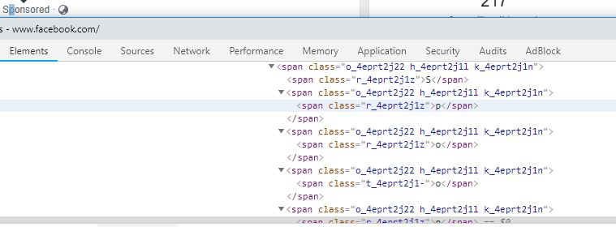

# Simple Obfuscate Text from Robots
Inspired by Facebook splitting of "Sponsored" text to bypass adblockers:


My intention is make it a little bit harder for basic scrapers to obtain emails, and phone numbers on my website.

# Usage
```
import ObfuscateText from "ObfuscateText";
<ObfuscateText text="this@is.email" />
```
